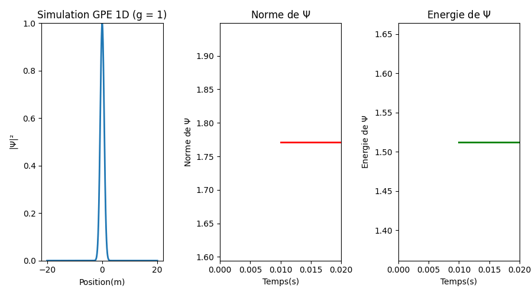
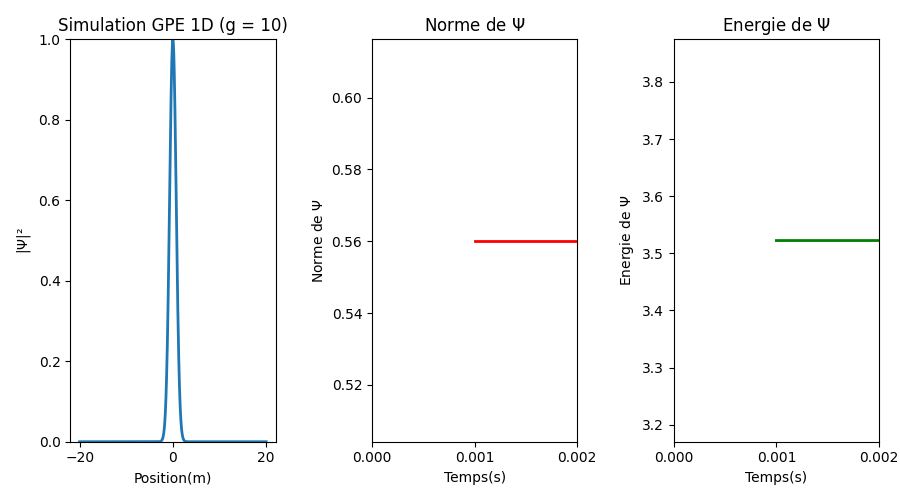
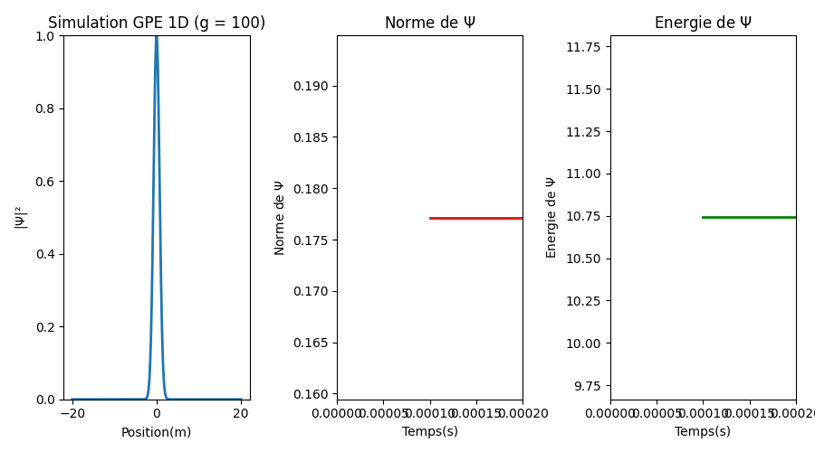
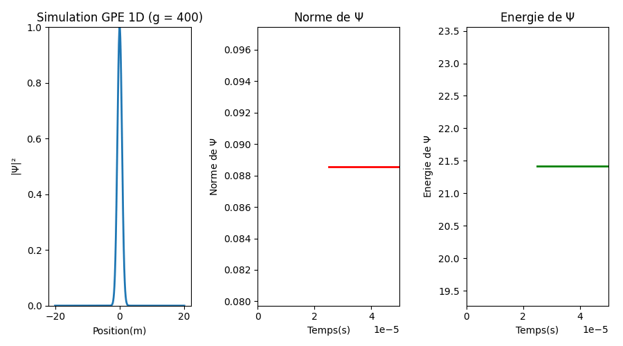

# Simulation GPE 1D — Équation de Gross-Pitaevskii

Simulation numérique de l'**équation de Gross-Pitaevskii (GPE) en 1D** par la méthode de **Crank-Nicolson**.
---

## Modèle physique

L'équation de Gross-Pitaevskii décrit la dynamique d'un condensat de Bose-Einstein à température nulle.

# Résultats:
### g = 1 — 

---

### g = 10 — 

---

### g = 100 — 

---

### g = 400 — 

